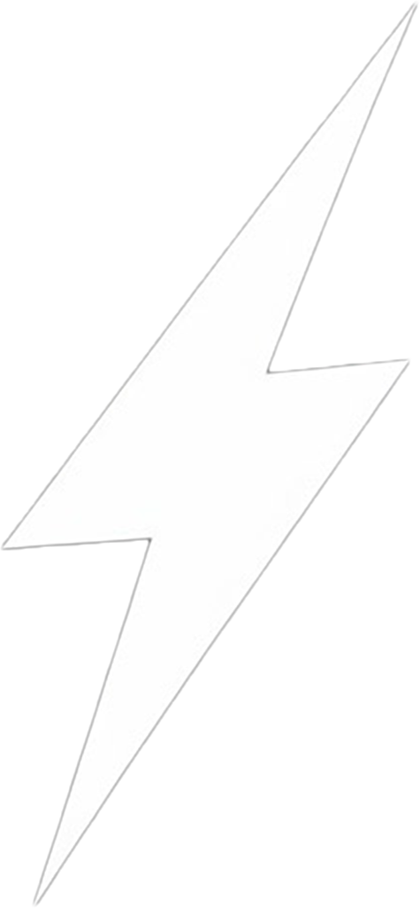

 
  

  &#xa0;

<h1 align="center">Meu Portfolio</h1>

  

  

  

<h3 align="center"> 
	Status
</h3> 

<h4 align="center"> 
	🚧  🚀 Em constante construção...  🚧
</h4> 

  <a href="#dart-sobre">Sobre</a> &#xa0; | &#xa0; 
  <a href="#rocket-tecnologias">Tecnologias</a> &#xa0;

 

## 🎯 Sobre ##

Site pessoal onde posso, além de me apresentar como profissional, colocar em prática novas tecnologias que venho estudando, além de exibir meus projetos.

## 🚀 Tecnologias ##

As seguintes ferramentas foram usadas na construção do projeto:

- [Next.js](https://nextjs.org/)
- [TypeScript](https://www.typescriptlang.org/)
- [Framer Motion](https://www.framer.com/motion/)
- [Tailwind CSS](https://tailwindcss.com/)
- [React Hook Form](https://www.react-hook-form.com/)
- [EmailJS](https://www.emailjs.com/docs/)
- [Zod](https://zod.dev/)

	Feito com 💜 por <a href="https://github.com/EdsonLucasbd" target="_blank">Edson Lucas</a>
</h4>

&#xa0;

	<a href="#top">Voltar para o topo</a>

